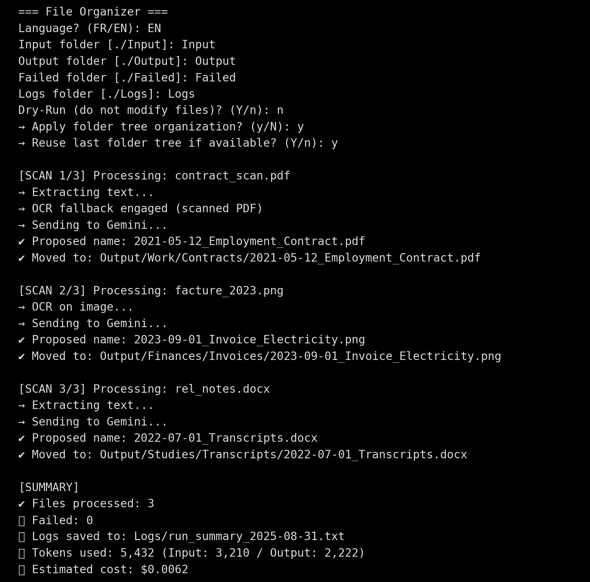

# 📂 File Organizer (v1.0.0)

[](https://www.python.org/)  
[](./LICENSE)  
[](https://ai.google.dev/)

Smart document organizer powered by **Google Gemini API**.  
Analyzes file content, **renames** files, and (optionally) **organizes** them into a structured **folder tree** — works in **English** and **French**.

---

## 🌍 Documentation

- 🇬🇧 You are reading the **English documentation** (main README).  
- 🇫🇷 [Lire la documentation en Français](./README_FR.md)

---

## 📸 Preview

### Terminal Preview


---

## ✨ Key Features

- **Bilingual support (EN/FR)**  
  Choose your language at startup — console messages, Gemini prompts, and folder tree adapt.

- **Content-aware renaming**  
  Generates meaningful filenames based on extracted content, includes detected dates.

- **Smart folder tree**  
  Optimized categories, limited roots, no duplicates/synonyms, fallback to `Misc/Divers`.

- **Re-use last folder tree**  
  Ensures consistent classification across runs. Minimal new subfolders added only when needed.

- **OCR fallback**  
  - Scanned PDFs (requires Poppler + pdf2image + Tesseract)  
  - Images (JPG/PNG/TIFF…) → OCR with Tesseract  
  - DOCX embedded images → OCR fallback if text is missing  

- **Safe & clean execution**  
  - Leftovers in `Input/` → moved to `Failed/` (subpath preserved)  
  - Empty input folders automatically deleted  
  - `.gitkeep` files removed in real runs (keeps clean structure for end-users)

- **Comprehensive logs**  
  - Rename proposals (dry-run)  
  - Error logs with reasons  
  - Run summary with token usage & estimated cost  
  - Last used tree saved (`arbo_last.json`) and reusable

---

## 📦 Download (Release)
Get the user-friendly pack here:  
👉 **https://github.com/ayoubechehab/File-Organizer/releases/latest**

---

## 📁 Folder Structure

```
Input/   → files to process
Output/  → renamed/organized files
Failed/  → errors & leftovers (subpaths preserved)
Logs/    → reports, proposals, errors, last folder trees
```

---

## 🔑 Setup

- Python 3.9+  
- Install dependencies:  
  ```bash
  pip install -r requirements.txt
  ```
- Install **Tesseract** for OCR (images, DOCX).  
- Install **Poppler** for OCR on scanned PDFs (optional but recommended).  

Paste your Gemini API key inside `api_key.txt`.

---

## 🚀 Quick Start

1) `pip install -r requirements.txt`  
2) Open `api_key.txt` and paste your **Gemini API key**  
3) `python file_organizer.py`  
4) Answer the prompts:
   - **Dry-Run?** (safe preview)  
   - **Apply folder tree?** (No / Yes)  
   - If **Yes**, choose between:
     - **Reuse last folder tree** (uses `Logs/arbo_last.json`; Gemini classifies and only adds minimal subfolders if required)  
     - **Fresh tree** (ignore previous arbo; Gemini builds a new tree from the current batch)

> On first run, these folders are created: `Input/`, `Output/`, `Failed/`, `Logs/`.  
> In apply runs, `.gitkeep` files are removed automatically to keep the folders clean.


---

## 🧠 How “reuse last tree” works
- After a run with a tree, the plan is saved to `Logs/arbo_last.json` (+ versioned copies in `Logs/arbo_history/`).  
- On the next run, if you choose **Reuse last folder tree**, Gemini **classifies the new files into your existing arbo** and creates **minimal subfolders** only if necessary.  
- Prefer **Fresh tree** when you want to ignore the past and build a new structure based on the current batch only.

---

## ❓ FAQ

**Q: Where do I put my API key?**  
A: Open `api_key.txt`, paste your key, save. You can also set an env var `GEMINI_API_KEY` or run `python file_organizer.py --api YOUR_KEY`.

**Q: Does dry-run call the API?**  
A: Yes. Dry-run sends content to Gemini to produce rename proposals (and a tree if you asked). It just **doesn’t modify files**. You can then choose to apply proposals **without extra API calls**.

**Q: What’s the difference between “Reuse last tree” and “Fresh tree”?**  
A: *Reuse* classifies into your previous arbo (`Logs/arbo_last.json`) and adds only minimal subfolders if needed. *Fresh* ignores the past and asks Gemini for a new structure from the current batch.

**Q: What file types are supported?**  
A: PDF, DOCX, XLSX/XLS, and images (JPG/PNG/TIFF/BMP/WebP). TXT is intentionally **excluded**.

**Q: Will English file names be translated?**  
A: No. English stays English. Arabic is summarized in French for the title (per the renaming rule).

**Q: Where are the logs?**  
A: In `Logs/`. You’ll see a `run_summary_*.txt` and an `errors_realrun_*.xlsx/csv` in apply runs. In dry-run, you’ll get proposals (`rename_proposals_*.xlsx/csv`) and a state file you can apply later.

**Q: I hit rate limits / quota (429). What now?**  
A: The script auto-retries with backoff. If it persists, wait a bit or reduce the batch size (in the script, set `BATCH_SIZE_TITLES = 50` or lower).

**Q: The model returned invalid JSON once — will it crash?**  
A: The script includes a **robust JSON parser** + raw-response logging. It tries to fix common issues and, if all else fails, continues the run (renaming + flat Output) rather than crashing.

**Q: Privacy?**  
A: Files are processed locally. Only extracted text snippets are sent to Gemini for renaming/classification.

---

## 🧪 Troubleshooting

- **No text extracted / OCR fails** → Install Tesseract OCR (Windows: UB-Mannheim build), or ensure the scanned image is clear.  
- **JSONDecodeError** → Already mitigated; check `Logs/llm_raw_*.txt` for the raw response if needed.  
- **Leftovers in Input** → The script moves any remaining files in `Input/` to `Failed/` at the end of an apply run and logs the reason.

---

## 🤝 Contributing
PRs and issues are welcome! See `CONTRIBUTING.md`.  


## 🧑‍💻 Author

- **Ayoub ECHEHAB**  
- 🌐 [Website](https://www.ayoubechehab.com)  
- 💻 [GitHub](https://github.com/ayoubechehab)  
- 📜 License: **MIT**
